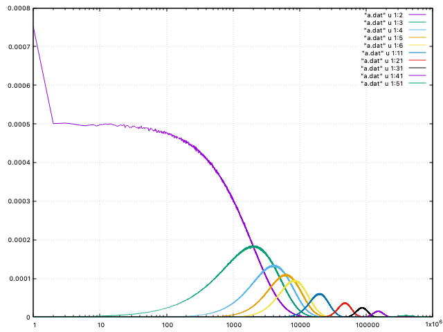
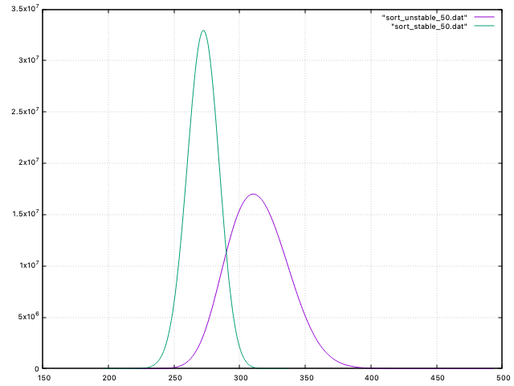

# ahc025

https://atcoder.jp/contests/ahc025

## 指数分布$N$個をソートしたら？

$N=50, D=50/8=6, sample=10^8$ で4分半くらい計算。

## ソートでは何回比較する？

$N=50, D=50/8=6, sample=10^9$

* sort_unstable_by: 13m19s849ms
* sort_by: 15m1s419ms

